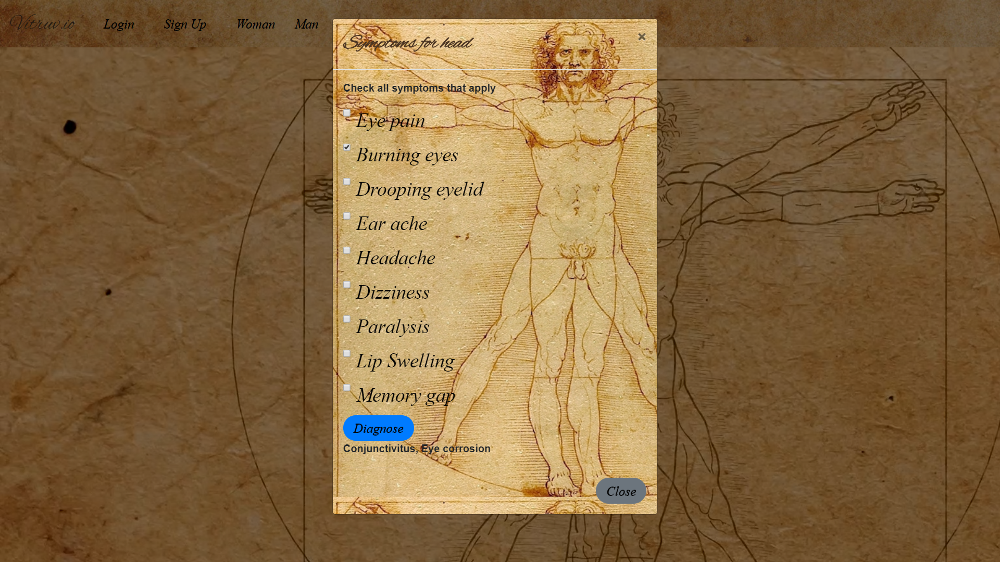
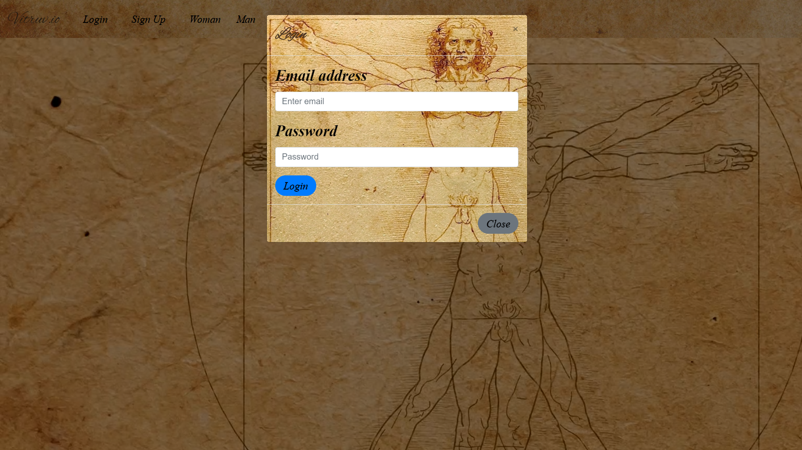
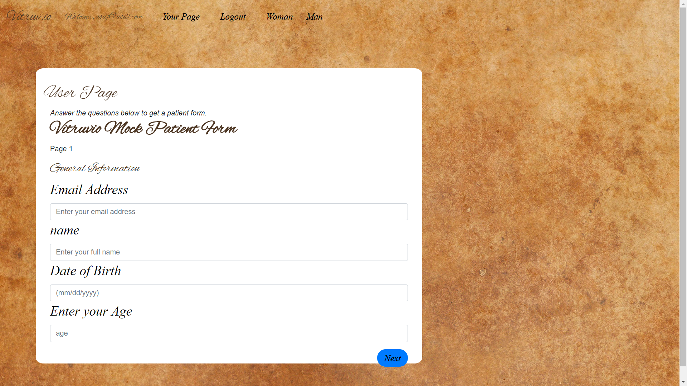

# Vitruv.io

## INTRODUCTION
___

___
Simple GUI that anyone can use in order to decide if maybe they need to "bite the bullet" and go see a doctor.

Interface utilizes SVG's facilitating mouseover on specific body parts, which then query our database for symptoms related to those areas, and when checked, return possible "diagnoses".

Not to be used in place of professional medical advice.
___

## INSTALL
___
clone from Github page

in terminal or gitBash, run a git clone in desired location to save app.

Run 'npm i' to download required packages.

## Finding Results
___
The app starts with the landing page which contains an image of the Vitruvian Man. on this image, there are click events for each body part. The user clicks on the body part pertaining to the ailment.

Once clicked on a part, a modal appears that displays a list of symptoms. The user checks off which symptoms they have and click the blue button labeled 'Diagnosis'. the results will be displayed below.

____
## Create an Account Feature
___

The App lets the user create an account for the website, which gives access to the user page feature. The user clicks on the button in the navigation bar labeled 'Sign Up' to get started.

The sign up modal appears with the required information needed from the user. Full name, email address, password, and to re-type the password. After all fields have been filled, the submit button will check if all the info is acceptable and then the user's account is created.

On the login Modal, it asks the user to enter their email address and password. 

___
## User Page
___

When the user succesfully signs in, the 'Your Page' button appears on the navigation bar. Clicking on that directs the suer to their saved user page.

On this page, there is a feature to fill out a mock patient form using a questionare rendered as a wizard form. 
